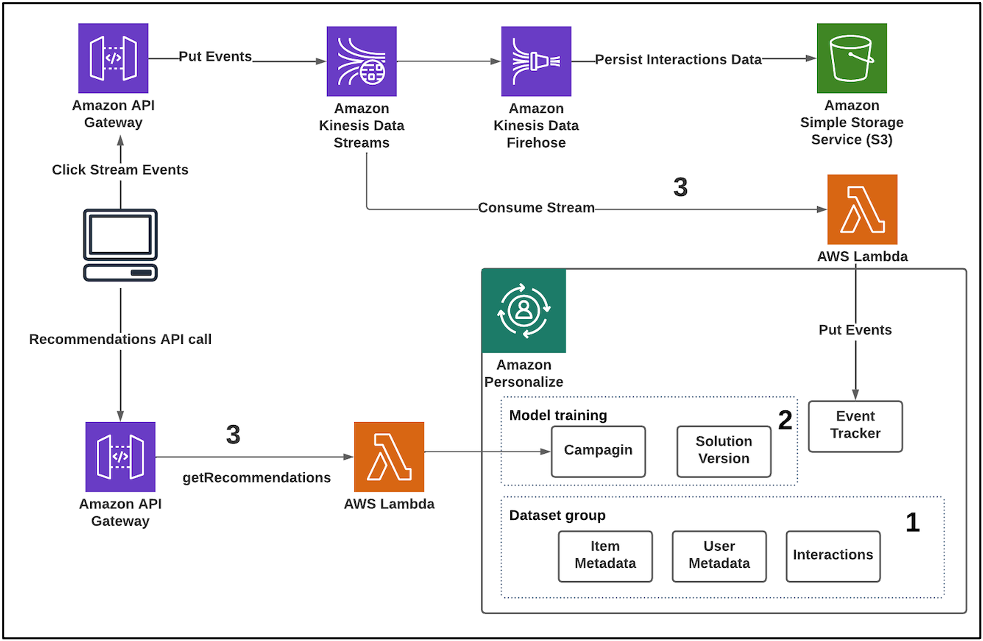
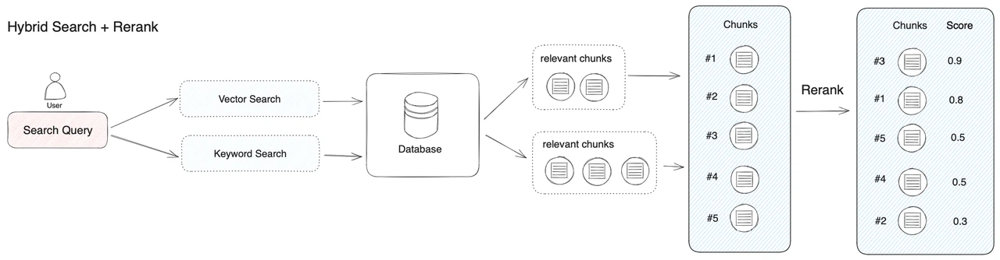
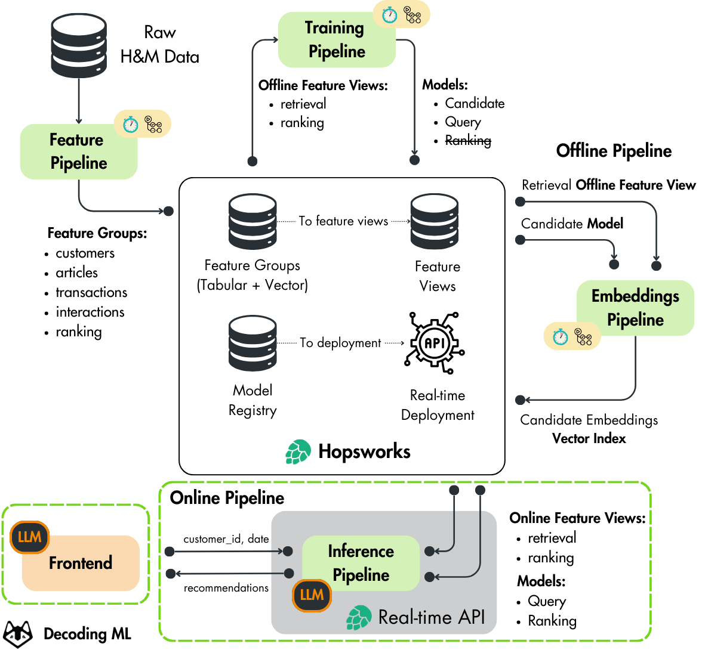
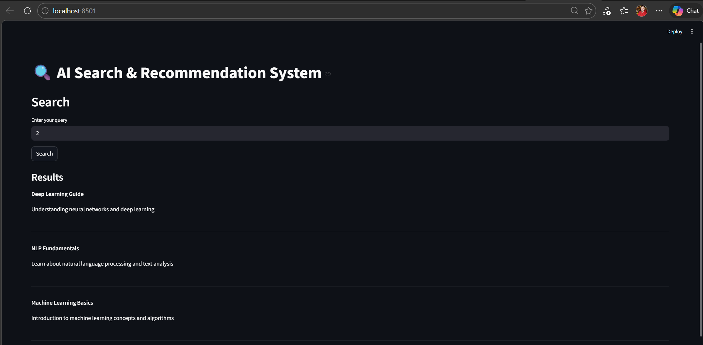
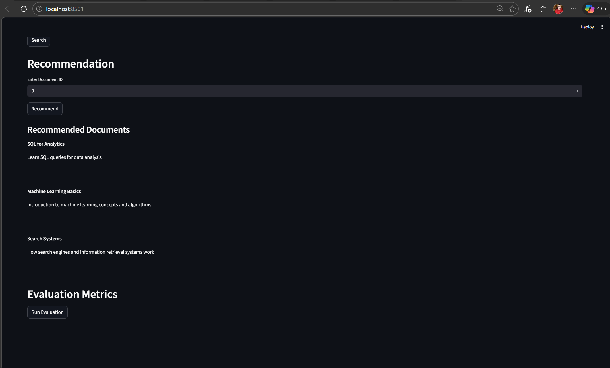
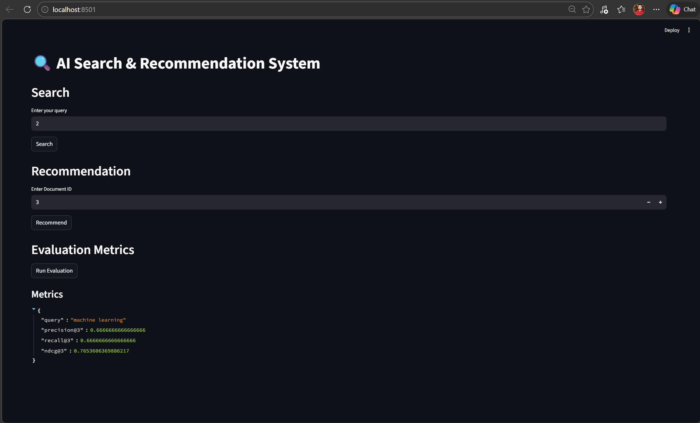

# 🚀 AI Search & Recommendation System


---

## 🔥 Overview
An end-to-end **AI Search + Recommendation System** combining:
- Hybrid Search (Vector + BM25)
- Re-ranking (Cross Encoder)
- Recommendation Engine
- Evaluation Framework

Built with a **production-style modular architecture**.

---

## 🏗️ System Architecture

### 🔹 High-Level Architecture


### 🔹 Hybrid Search + Reranking Pipeline


### 🔹 Advanced ML Pipeline (Feature + Embedding + Inference)


---

## 🔍 Search Pipeline Flow

Query → Hybrid Retrieval → Re-ranking → Final Results  
→ Recommendation → Evaluation

---

## 🚀 Features

- 🔍 Hybrid Search (FAISS + BM25)
- 🧠 Query Understanding & Semantic Retrieval
- 📊 Cross-Encoder Re-ranking (Improves accuracy)
- 🎯 Content-Based Recommendation System
- 📈 Evaluation Metrics (Precision@K, Recall@K, NDCG)
- ⚡ FastAPI Backend
- 🎨 Streamlit Frontend UI

---

## 🖥️ Application Screenshots

### 🔍 Search Results


### 🎯 Recommendations


### 📊 Evaluation Metrics


---

## 🧠 Tech Stack

- Python, FastAPI, Streamlit  
- Sentence Transformers (Embeddings, Cross-Encoder)  
- FAISS (Vector Search)  
- BM25 (Keyword Search)  
- Scikit-learn  
- Docker (Ready)

---

## ▶️ How to Run

### 1. Clone Repo
```bash
git clone <your-repo-link>
cd ai-search-recommendation-system
```

### 2. Setup Environment
```bash
python -m venv venv
venv\Scripts\activate
```

### 3. Install Dependencies
```bash
pip install -r requirements.txt
```

### 4. Run Backend
```bash
uvicorn app.main:app --reload
```

### 5. Run Frontend
```bash
streamlit run frontend.py
```

---

## 📊 API Endpoints

- `/search` → Hybrid + Semantic Search  
- `/recommend` → Recommendation Engine  
- `/evaluate` → Performance Metrics  

---

## 💡 Key Learnings

- Designing scalable AI systems beyond notebooks  
- Combining retrieval, ranking, and recommendation  
- Evaluating search systems using real metrics  
- Building full-stack AI applications  

---

## 🔮 Future Improvements

- User-based personalization (collaborative filtering)  
- Feedback loop for continuous learning  
- LLM-based answer generation (RAG)  
- Cloud deployment (AWS / Azure)  

---

## 👤 Author

**Tonumay Bhattacharya**  
Data Scientist | NLP | GenAI | ML Engineer
